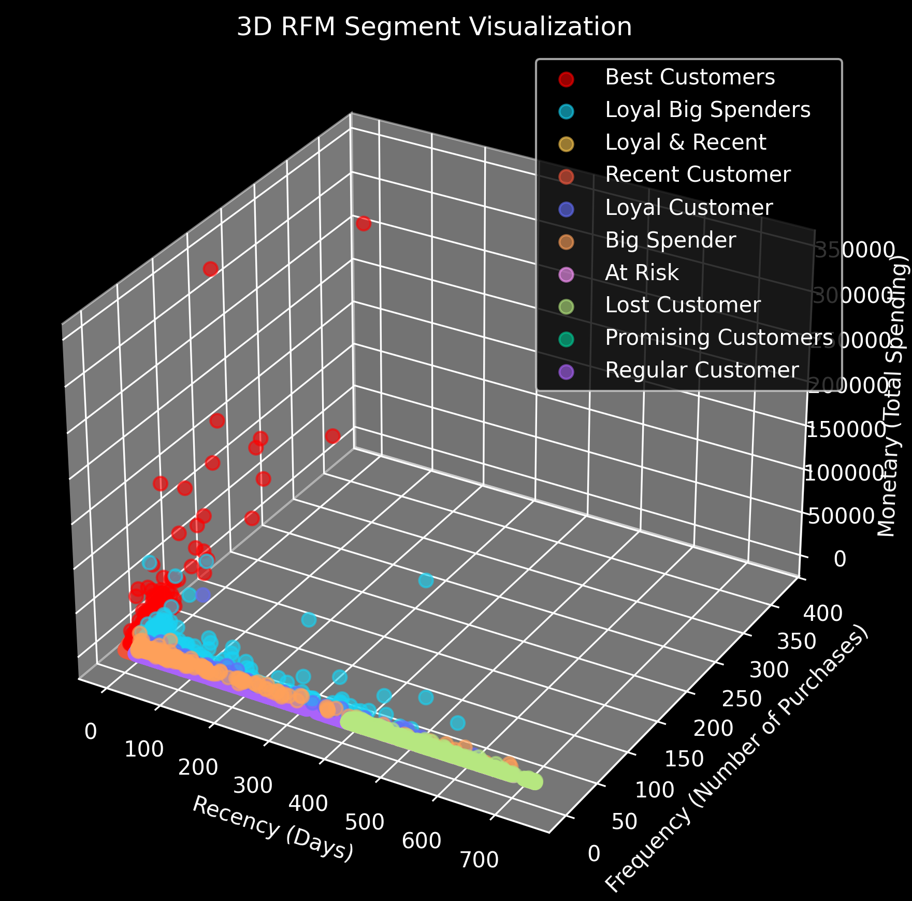
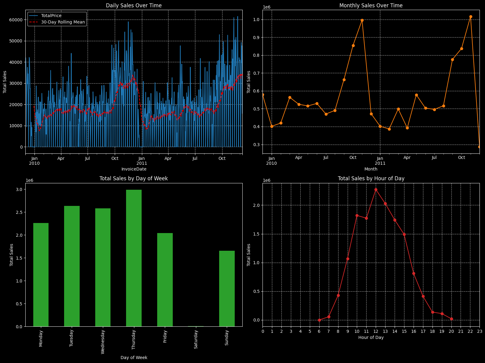

# Complete Customer Analytics with Online Retail II Dataset

<p align="center">
  
  
</p>

## 📝 Project Summary

This project provides a comprehensive, end-to-end customer analytics solution using the Online Retail II dataset. It transforms over one million raw transactional records into actionable business insights. The core of this project involves:

*   **RFM Segmentation:** Identifying distinct customer segments such as "Champions" and "At-Risk" by analyzing their **Recency, Frequency, and Monetary** value to enable targeted marketing strategies.
*   **Predictive Churn Modeling:** Building and deploying an **XGBoost** model to proactively identify customers with a high probability of churning, and analyzing the key factors that drive this behavior.
*   **Customer Lifetime Value (CLV) Forecasting:** Implementing probabilistic models (**BG/NBD** and **Gamma-Gamma**) to predict the future purchasing behavior and monetary value of customers, guiding long-term strategic investments.
*   **Statistical A/B Testing:** Designing and executing a simulated A/B test to statistically measure the impact of a discount campaign on customer spending, using the **Mann-Whitney U test** for significance.

## 🎯 Project Objectives

The main business objectives of this project are:

*   Identify the most valuable customer segments and their common characteristics.
*   Pinpoint customers at high risk of churn and understand the factors influencing this risk.
*   Estimate the future value (CLV) of customers to guide marketing budget allocation.
*   Determine the effectiveness of a marketing campaign on increasing customer spending.

## 🛠️ Tech Stack

<p align="left">
    <a href="https://www.python.org" target="_blank">  </a>
    <a href="https://pandas.pydata.org/" target="_blank">  </a>
    <a href="https://numpy.org/" target="_blank">  </a>
    <a href="https://scikit-learn.org/" target="_blank">  </a>
    <a href="https://xgboost.ai/" target="_blank">  </a>
    <a href="https://lifetimes.readthedocs.io/en/latest/" target="_blank">  </a>
    <a href="https://matplotlib.org/" target="_blank">  </a>
    <a href="https://seaborn.pydata.org/" target="_blank">  </a>
    <a href="https://scipy.org/" target="_blank">  </a>
</p>

## 📂 Project Structure

*   `data/`: Contains raw, intermediate, and final datasets.
*   `images/`: Stores visual assets used in the README.
*   `notebooks/`: Houses the Jupyter Notebooks for each analysis stage.
    *   `01_Data_Preprocessing_EDA.ipynb`
    *   `02_RFM_and_Segmentation.ipynb`
    *   `03_Churn_Prediction.ipynb`
    *   `04_CLV_Analysis.ipynb`
    *   `05_AB_Testing.ipynb`
*   `pyproject.toml`, `uv.lock`: Files for modern dependency and environment management.
*   `README.md`: This project overview.

## 📊 Data Dictionary

The dataset contains transactional data from a UK-based online retail company. Key fields used in the analysis include:

| Feature     | Description                                                                   | Type         |
|-------------|-------------------------------------------------------------------------------|--------------|
| `Invoice`   | A 6-digit nominal, unique for each transaction. 'C' indicates a cancellation. | `object`     |
| `StockCode` | A unique code assigned to each distinct product.                              | `object`     |
| `Description`| The name of the product.                                                      | `object`     |
| `Quantity`  | The number of units of a product sold in a transaction.                       | `int64`      |
| `InvoiceDate`| The date and time when the transaction occurred.                              | `object` |
| `Price`     | The unit price of the product in British Pounds (£).                          | `float64`    |
| `Customer ID`| A 5-digit unique identifier for each customer.                                | `float64`    |
| `Country`   | The country where the customer resides.                                       | `object`     |

## 🔄 Analysis Workflow & Notebook Details

This project follows a sequential workflow, with each step detailed in its respective Jupyter Notebook.

1.  **Data Cleaning and EDA** (`notebooks/01_Data_Preprocessing_EDA.ipynb`)
    *   Cleans and preprocesses over 1 million records, handling missing values, duplicates, and cancellations.
    *   Performs feature engineering to create analysis-ready features.
    *   Applies `IsolationForest` for sophisticated outlier detection.
    *   Conducts comprehensive exploratory data analysis (EDA) to uncover trends in sales over time, by country, and by product.

2.  **RFM Analysis & Segmentation** (`notebooks/02_RFM_and_Segmentation.ipynb`)
    *   Calculates Recency, Frequency, and Monetary (RFM) metrics for each customer.
    *   Segments customers into actionable groups like "Best Customers," "At-Risk," and "Promising Customers."
    *   Visualizes segment distributions and characteristics using 2D and 3D plots.

3.  **Churn Prediction** (`notebooks/03_Churn_Prediction.ipynb`)
    *   Defines churn based on a 90-day inactivity window.
    *   Builds and compares `Logistic Regression`, `Random Forest`, and `XGBoost` models.
    *   Evaluates models using ROC-AUC, F1-score, and confusion matrices to identify the best-performing algorithm.
    *   Visualizes feature importance to understand key drivers of customer churn.

4.  **CLV Analysis** (`notebooks/04_CLV_Analysis.ipynb`)
    *   Implements the probabilistic **BG/NBD** model to predict future transaction frequency.
    *   Uses the **Gamma-Gamma** model to estimate the average monetary value of transactions.
    *   Develops a hybrid XGBoost model using **BG/NBD** features for enhanced CLV prediction.
    *   Compares CLV results with RFM segments for validation.
    *   Visualizes CLV distribution and identifies key customer groups.

5.  **A/B Testing** (`notebooks/05_AB_Testing.ipynb`)
    *   Simulates an A/B test scenario to measure the impact of a discount campaign.
    *   Applies appropriate statistical tests (**Shapiro-Wilk** for normality, **Mann-Whitney U** for comparison) to determine statistical significance.
    *   Provides clear visualizations and reporting of the test results.

## 🚀 Setup and Execution

### Environment Setup (Windows PowerShell)

1.  Ensure **Python 3.12+** is installed.
2.  Clone the repository:
    ```powershell
    git clone https://github.com/mertafacan/Complete-Customer-Analytics-for-E-Commerce.git
    cd Complete-Customer-Analytics-for-E-Commerce
    ```
3.  (Recommended) Create and activate a virtual environment:
    ```powershell
    python -m venv .venv
    .\.venv\Scripts\Activate.ps1
    ```
4.  Install the required dependencies using a modern package manager. `uv` is recommended for its speed.
    *   **Using uv (Recommended):**
        ```powershell
        pip install -U uv  # Install uv if you haven't already
        uv pip install -e .
        ```
    *   **Using pip:**
        ```powershell
        pip install -U pip
        pip install -e .
        ```
5.  Launch Jupyter Notebook or JupyterLab and navigate to the `notebooks/` directory to explore the analyses. (Optional)
    ```powershell
    jupyter notebook
    ```

## 📬 Contact

Mert Afacan – [https://www.linkedin.com/in/mert-afacan/](https://www.linkedin.com/in/mert-afacan/) – [mert0afacan@gmail.com](mailto:mert0afacan@gmail.com)
